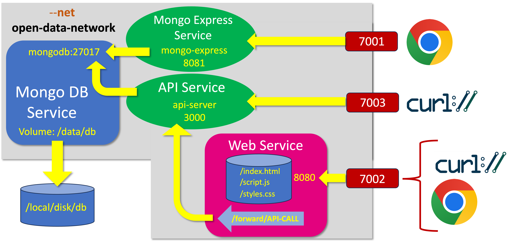

# Open Data Project
## Design Sketch




## API Server
### Environment

#### Configuring access to mongo db server:

Parameter  | Default Value
:------------|:---------------
OD_CONFIG_MONGODB_SERVER          | 'mongodb-server' 
OD_CONFIG_MONGODB_PORT            | '27017' 
OD_CONFIG_MONGODB_ADMINUSERNAME   | 'trude' 
OD_CONFIG_MONGODB_ADMINPASSWORD   | 'rosi' 
OD_CONFIG_MONGODB_DB_NAME         | 'opendata' 
OD_CONFIG_MONGODB_COLLECTION_NAME | 'people'


 If the  _OD_CONFIG_MONGODB_URI_ is set, the above values are ignored.
 
 Parameter | Default Value | Syntax
:------------|:--------------- |:--------
OD_CONFIG_MONGODB_URI   | '' | mongodb://[USERNAMAE:PASSWORD@]HOSTNAME:PORT

## Web Server
### Environment

#### Configuring API web service:
Parameter | Default Value 
:------------|:---------------
OD_API_SERVER_HOST | api-server
OD_API_SERVER_PORT | 7003
OD_CONFIG_PORT     | 7002 
OD_CONFIG_SITE_BASEURL | '/' 

## Examples

### Fetching and installing the system

The following example is using a particular set of 'ports' to the outside.
Port | Default Value 
:------------|:---------------
Mongo DB Viewer (Expess) |  7001
API ports        | 7003
Web Ports        | 7002 

This is because only port range 7000 - 7020 is opened to the outside 
from our VM's at the Juelich Supercomputer Center.

```
#
#  Get the OpenData code from GitHub
#
mkdir scicat
cd scicat
git clone https://github.com/PatrickFuhrmann-HTWBerlin/OpenData.git
#
# build the API server docker container
#
cd OpenData/services/API
docker build -t api-server .
#
# build the WEB server docker container
#
cd ../WEB/
docker build -t web-server .
#
#  Start the services
#
cd ../..
cd scripts/
#
#  Mongo db server
#  (Normally you would have to create the
#   internal network first. like
#   'docker network create open-data-network
#  but that's done inside the start script
#  of mongodb.
#
./start-mongodb-server.sh 
docker network ls
docker ps
#
#  Start the mongo db viewer
#  Warning: it takes up to 30 seconds
#  for the viewer to connect to the mongodb
#  server. It first tries to connect to
#  mongo:27017. Only after a timeout it uses
#  the configure environment variables for
#  the mongodb containername (hostname) and the
#  mongodb listen port.
#
./start-mongo-express.sh 
docker ps
#
#  now starting the API and the WEB server.
#
./start-api-server.sh 
./start-web-server.sh
```
### Testing the functionality

#### On the local machine (where the services are running)

To test the service locally (on the docker hosts) you can try the scipts in 
the script directory:
```
people-add.sh <name> <givenName> <birthday>
people-search.sh "name=<name>&..."
people-remove.sh <name> <givenName> <birthday>
```
Before using them you need to set the ENV , so that the script
finds the service host/ports.
```
#
# Define host and port of the API server
#
export OD_API_HOST=localhost
export OD_API_PORT=7003
```
There is a test for create/display/remove account:
```
./test-api-server.sh
```

The test will create
- an account (which should succeed)
- tries to create the same account again (which should fail)
- displays the json output of the account
- removes the account (which should succeed)
- removes the same account again (which should fail) 

The output should somehow look like this:

```
--- Adding Random user Last-160700 Given-160700 2000-01-01

{"acknowledged":true,"insertedId":"66268b241e945905286ef53b"}

--- Adding same user again!

{"error":"Account already exists!"}

--- Searching for the user!

[
  {
    "_id": "66268b241e945905286ef53b",
    "name": "Last-160700",
    "givenName": "Given-160700",
    "birthday": "2000-01-01T00:00:00.000Z"
  }
]


--- Removing the user again!

{"acknowledged":true,"deletedCount":1}

--- Removing the same user!

{"acknowledged":true,"deletedCount":0}
```
To test the Web server, you need to change the environment as follows:

```
export OD_API_PORT=7002       # Web server port
export OD_API_PREFIX=/forward # use the webserver path through to the API server
```

Now the 
```
./test-api-server.sh
```

should show the same results.

```

#### On a remote machine

On a remove machine (your laptop) the process is assentially the same, except that
the hostname 'OD_API_HOST' has to be set to scicat-0X.webhop.net instead.

And you can try to access the webservice with your browser, using the URL
```
http://scicat-0X.webhop.net:7002
```
